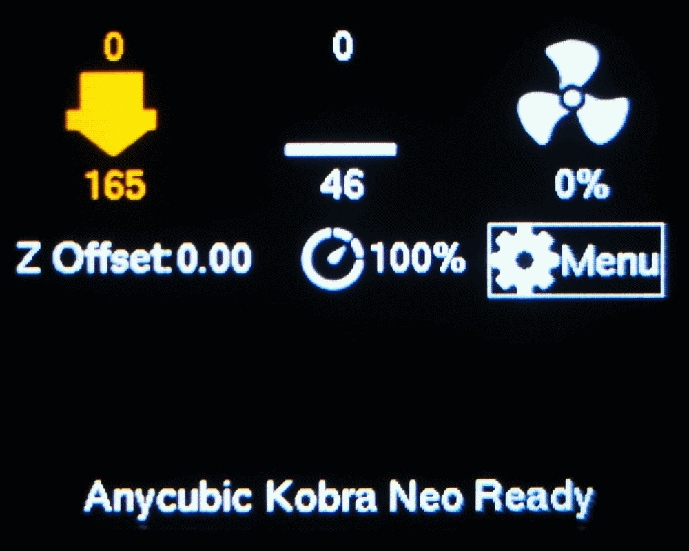

## Modified Anycubic Kobra Neo V1.3.3 Firmware
### Custom Kobra Neo Firmware v1.3.3 
#### So many changes have been made to this firmware that it could be considered the unofficial v1.3.4 edition.

## Changes
- Increased default extruder max feedrate from 25 to 50 (now retraction speed is not limited to 25mm/s)
- X and Y default max acceleration increased from 500 to 1000
- Default X and Y jerk increased from 5 to 8
- Enabled advanced menu items (Leveling Edit Mesh + Bed Tramming, Configuration Controller Fan, Advanced Settings, etc...)
- Enabled "Host Actions" and "Host Action Prompts" with support for the printer UI (allows starting/pausing/resuming of Octoprint prints)
- Increased probing accuracy by doing multiple probes per point
- Increased speed for the first Z-probe approach when double-probing
- Enabled quick home (X and Y homes at the same time)
- Re-enabled custom progress and status message on screen.

## Dark UI v1.0

- UI themed with black background, dark orange images and white text (DarkUI v1.0)

## A note on Linear Advance 
Unfortunately it seems that uncommenting #define LIN_ADVANCE is not enough to get linear advance to work properly with this version of Marlin and the Kobra Neo. While the feature itself works, there were issues with linear advance and TMC2208 drivers up until around mid 2022.

I have thoroughly examined the Bugfix for Marlin 2.1xx and merged the fix for linear advance with TMC2208 drivers - it seems multiple stepper pulses were being generated which caused the extruder to randomly stop, all changes have been merged and Linear Advance should be usable again.

For more information about the bugfix visit https://github.com/MarlinFirmware/Marlin/pull/24533#issue-1313337917

## Flashing
Copy firmware.bin to your microSD card, insert the card with the printer off, turn printer on and wait until you get to the home screen. Afterwards, delete the firmware.bin file from your card.

## Reset EEPROM
After flashing, I recommend to reset your EEPROM, as I found that even after changing some values in the firmware, the printer still used the old values saved in EEPROM.

Ways to reset EEPROM:
- Menu->Configuration->Advanced Configuration->Initiliaze EEPROM; 
- Using Prontercace/Octoprint: send M502 and M500;
- Use the EEPROM Editor plugin in Octoprint

## Perform a PID autotune and calibrate your e-steps!
This firmware contains values for my own printer, but even the stock firmware does not have great values. 

Even after doing all the hardware and mechanical touch-ups, I was not getting great prints. This was solved by calibrating E-steps, as they were quite off (instead of extruding 100mm of filament, my printer extruded 95mm before calibration), so make sure you do that as well.

## PID Autotune using the menu:

- Turn Fan Speed to 100%
- PID Autotune: Go to Menu->Configuration->Advanced Settings->Temperature
- select PID Autotune E1, and set your printing temperature. Wait for the Autotune to complete.
- Now do the same for PID Autotune Bed. 
- Go way back to the Configuration menu and select Store Settings.

## PID Autotune using Pronterface/Octoprint
If you'd like to perform PID Autotune using Octoprint or Pronterface, follow: https://teachingtechyt.github.io/calibration.html#pid

## E-Step Calibration
To perform E-Step calibration, I reccomend to follow this guide: https://teachingtechyt.github.io/calibration.html#esteps

# Building
https://www.reddit.com/r/anycubic/comments/y2waxu/tutorial_how_to_build_anycubic_marlin_source_code/

## Based on
https://github.com/sjorge/Kobra_Neo_Fw

https://github.com/jojos38/anycubic-kobra-improved-firmware

https://github.com/Auburn/Kobra_Go
